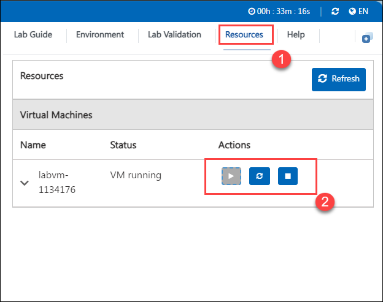

# **Getting Started with Your Power Platform Workshop: Administration and Governance Workshop**
 
Welcome to your Power Platform Workshop: Administration and Governance workshop! We've prepared a seamless environment for you to explore and learn about Azure services. Let's begin by making the most of this experience:
 
## **Accessing Your Lab Environment**
 
Once you're ready to dive in, your virtual machine and **Lab Guide** will be right at your fingertips within your web browser.

   

### **Virtual Machine & Lab Guide**
 
Your virtual machine is your workhorse throughout the workshop. The lab guide is your roadmap to success.
 
## **Exploring Your Lab Resources**
 
To get a better understanding of your lab resources and credentials, navigate to the **Environment Details** tab.

   
 
## **Utilizing the Split Window Feature**
 
For convenience, you can open the lab guide in a separate window by selecting the **Split Window** button from the Top right corner.
 
   
 
## **Managing Your Virtual Machine**
 
Feel free to start, stop, or restart your virtual machine as needed from the **Resources** tab. Your experience is in your hands!
 
  

## **Let's Get Started with Azure Power Apps Portal**

1.  In the JumpVM, click on **Power Apps** portal shortcut of Microsoft Edge browser that is available on desktop.

    

1. On the **Sign in** window, you will see the login screen, enter the following username  and click on **Next**.

   * Email/Username: <inject key="AzureAdUserEmail"></inject>

        

1. Now enter the following **password**  and click on **Sign in**. 

    * Password: <inject key="AzureAdUserPassword"></inject>
  
        

1.  Once logged in, click on **Environment** and select the default environment named **OTU WA CNE <inject key="Deployment ID" enableCopy="false" />**.

    

1. Select **Solutions** and click on **Create database**.

    

1. Now, leave all options as default and click on **Create my database** and database creation process will start.
 
    

1. . Now, click on the **Next** from the lower right corner to move to the next page.

   
 
Now you're all set to explore the powerful world of technology. Feel free to reach out if you have any questions along the way. Enjoy your workshop!
