## Admin in a day

# M05B-HOL-Dataverse for Teams (Optional)

## Table of Contents

1. Exercise 1 - Create your first app

   **Scenario**
   
   - Task 1: Add Power Apps and pin it

    - Task 2: Create an application and table

3. Exercise 2 – Share your app

   **Scenario**
   
   - Task 1: Share the app

#### Hands-on lab

## Lab Scenario

In this hands-on lab, you will create a Power App in a team and see how to publish it to your team. You will also share with colleagues outside your team to see how broad distribution apps 
work.

## Lab Test Environment

This hands-on lab is designed to be completed in an environment setup for multiple students to complete the Admin in a day series of hands-on labs.

You will be assigned one or more users to use to complete the tasks. Because this is a shared environment, some tasks that require a tenant Global Administrator or a Service Administrator 
will already be completed. Your account will only be an environment administrator.

## Exercise 1: Create your first app

### Task 1: Add Power Apps and pin it

In this task, you will add the Power Apps app, and then pin it to your pinned apps.

1. Navigate to Microsoft Teams and log in with the **admin account**.

2. Select the **ellipsis** (...), entitled **More added apps**, button within the navigation bar to the left of the screen.

   

3. Search for power apps and select **Power Apps**.

   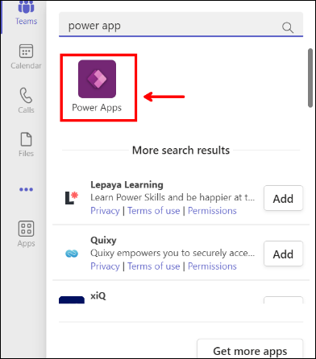

4. Within the navigation bar, right-click on the **Power Apps** app and select **Pin**.

   

5. Do not navigate away from this page.

### Task 2: Create an application and table

In this task, you will create an application, and a table, and add new columns to the table.

1. Navigate to Microsoft Teams and log in.

2. Select **Use the web instead** if prompted.

3. Select **Power Apps (1)** from the navigation bar, then select the **Home (2)** tab and choose **Start now (3)**.

   

4. Select the **Central IT (1)** team and then select **Create (2)**.

   

5. Enter **Special Request LA X** and select **Save**. Replace X with your lab user number.

   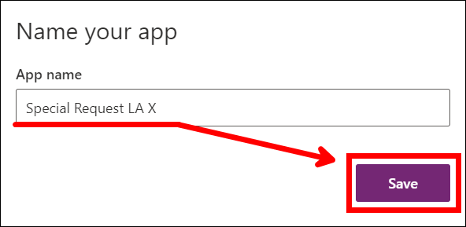

6. Select **With data (1)**, and then select **+ Create new table (2)**.

   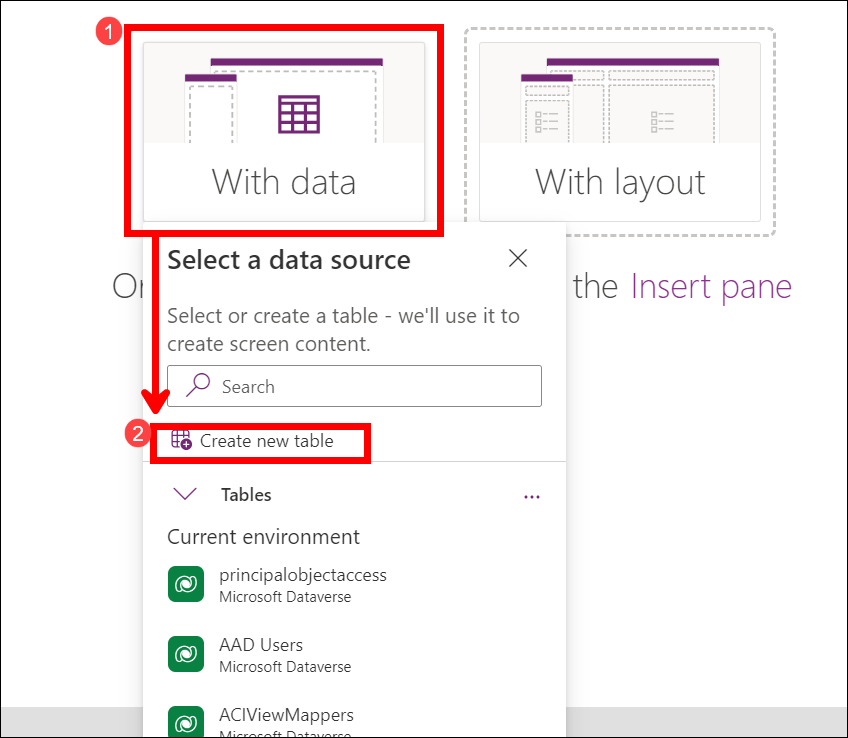

1. On the **Create table** pane, select **Start with a blank table**.

   

7. Enter **Lab X Request** for the Table name, replacing X with your Lab Admin number and choose **Create**. Replace X with your lab user number.

   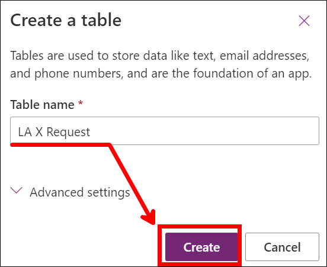

8. Select **+ New column**.

   

9. Enter **Description** for Name, select **Text > Plain Text (Single line of text)** for Data type if not chosen already.

   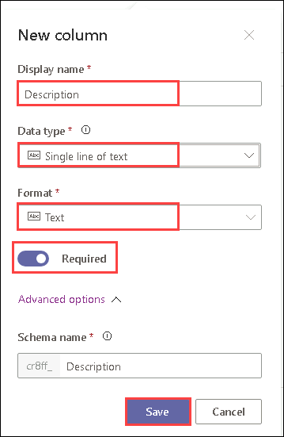

11. Select **+ New column** again.

12. Enter **Requested date** for the Display name, select **Date and time > Date Only** for the Data type (the Format will Autofill), and then select **Save**.

    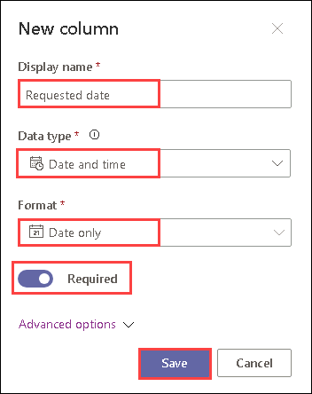

13. The table should now show three columns. Select the first cell within the **Name** column, and type **Ergonomic office chair** and Enter a description within the **Description** cell and select today’s date for **Requested date** cell.
 
    

15. Add a few more request rows and select **Close**. You can use the following data to enter into the cells of the table:

     | Name                         | Description                                           | Date           |
     | ---------------------------- | ----------------------------------------------------- | -------------- |
     | Plotter Printer              | Facilities department needs a plotter printer         | (today's date) |
     | Security system              | The new A245 building doesn't have a security system  | (today's date) |
     | Fire suppression system test | Test the fire suppression system in buildings         | (today's date) |

     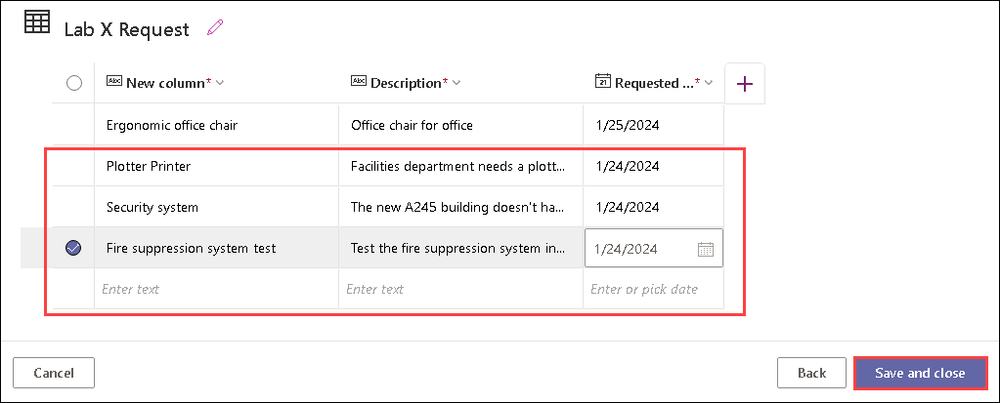

16. The app should now have a gallery and a form. Select **Save** and wait for the app to be saved.

    

17. Select **Preview**.

    

18. The app should start in a preview. Select **+ New record**.

    

19. Provide a Name, Description, and Requested data. Use the following data to fill in the fields for the new request:

     | New Column                         | Description                                                         | Requested Date |
     | ---------------------------- | ------------------------------------------------------------------- | -------------- |
     | Covered outdoor work area    | Build a covered outdoor work area on the west side of building Az45 | (today's date) |

20. Select the **checkmark** in the top right-hand corner to **Save** the record.

    

21. **Close** the preview.

    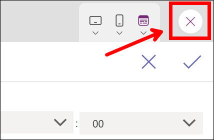

22. Select **Publish to Teams**.

    

23. Review the information and select **Next**.

    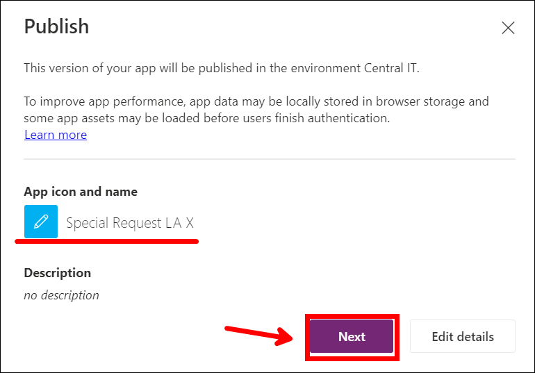

24. Select the **Plus sign** next to the **General** channel to **Add app as a tab**. This will make it discoverable on the channel. Then, Select **Save and close**.

    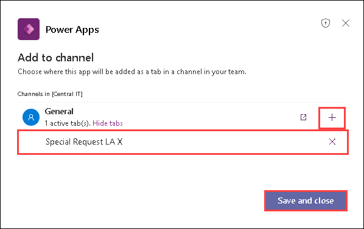

25. From the navigation bar, select **Teams** and then select the **General** channel of the **Central IT** team.

26. Locate the app tab you added and select it. The app should load.

    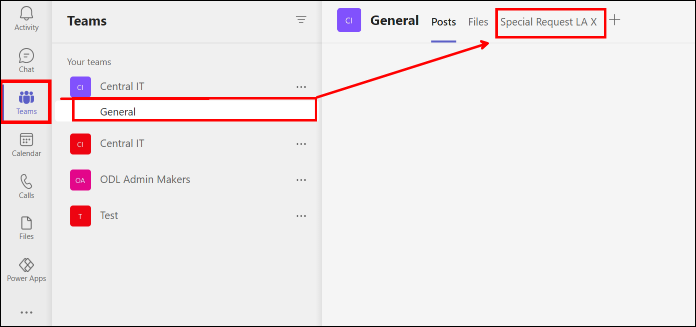

27. Ensure that you can see all of the data you entered into the app while it is in preview mode.

    

28. Do not navigate away from this page.

## Exercise 2: Share your app

### Task 1: Share the app

In this task, you will share the application and the table you created.

1. Select **Power Apps (1)** from the navigation bar to the left of the screen, then select **Build (2)**.

   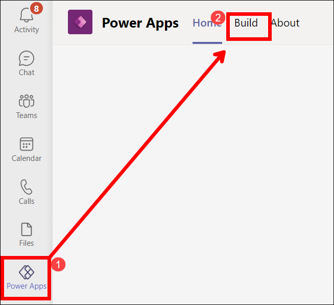

2. From here, choose the **Central IT (1)** team, and select **See all (2)**.

   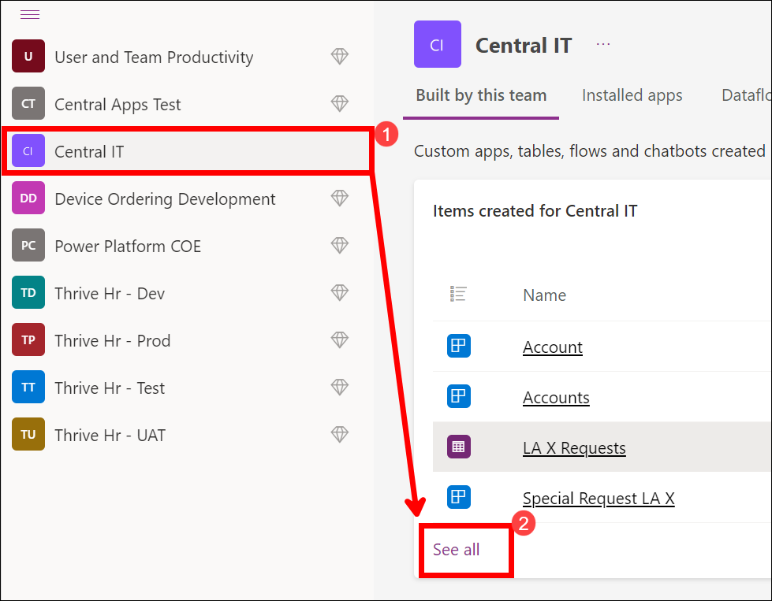

3. Select **Apps (1)** and then choose **Share with colleagues (2)**. This can share the app outside the team’s membership.

   

4. Within the search bar, search for lab and select **Lab Admin Team**.

   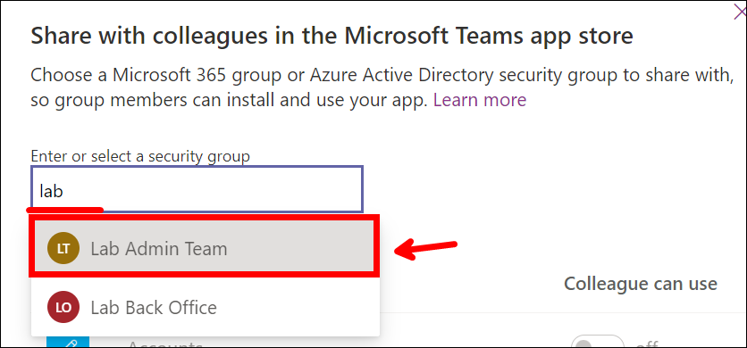

5. Make sure the **Lab Admin Team** team members can use the app and then select **Save**.

   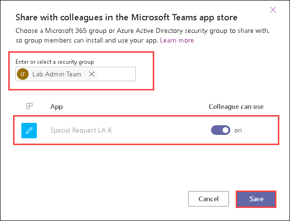

6. Select **Tables**, select the table you created and choose **Manage permissions**.

   

7. Select the **Lab Admin Team** team, give the team members the **Collaborate** permission, and select **Save**. You have now completed sharing with the group.

   
