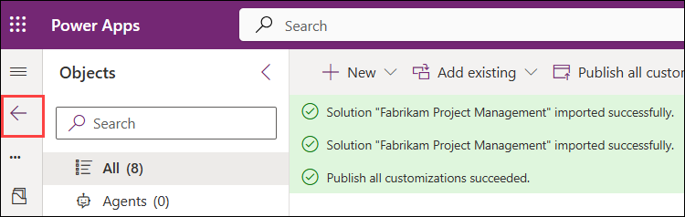
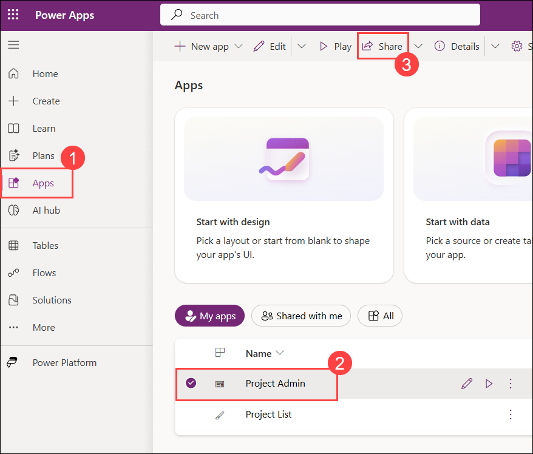
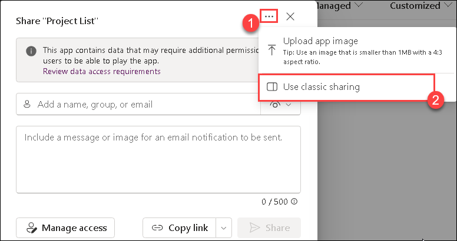
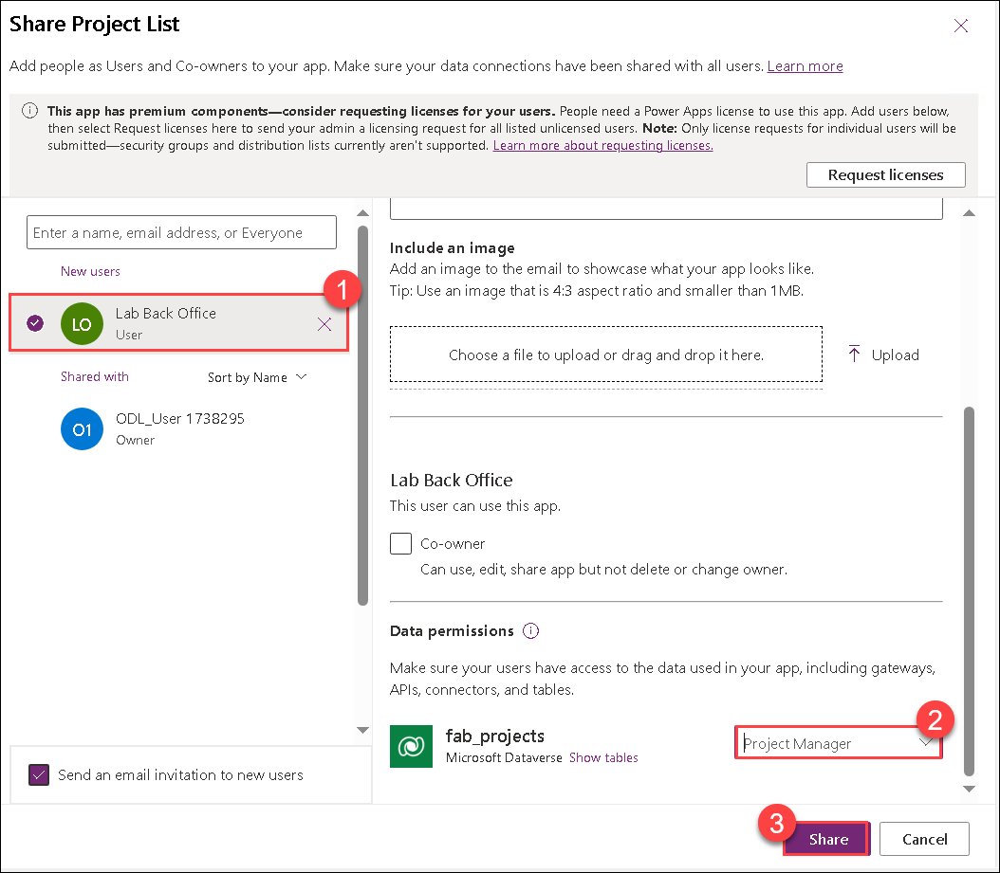

This document contains the removed sections from the May 2026 release of the Administration and Governance learning path. These sections have been removed due to changes in the product or updates to the learning path content.

## Lab 1 Ex 5
### Task 3: Share app

In this task you will, share the Project List app with a security group and assign the custom Project Manager role to control access.

1. Go back to the **Solutions** page by selecting the **Back to Solutions** button. 

   

1. Click on **Apps (1)**, then select the radio button of the **Project List (2)** application, and select **Share (3)**.

   

1. On the **Share** pane, select the **ellipses (1)**, and select **Use classic sharing (2)**.

        

1. On the **Enter a name, email** box, search for **Lab Back Office (1)** and select it. Under **Data permissions** section , from the drop-down, select the **Project Manager (2)**, and then select **Share (3)**

    

1. Close the share pane.

